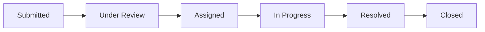

# College Complaint Management System

> A centralized digital platform for students to report campus issues and track them through to resolution.

**Status:** Deployed and live

| | |
|---|---|
| Live App | <!-- paste Vercel URL here, e.g. https://your-app.vercel.app --> _pending deployment_ |
| Backend API | <!-- paste Render URL here, e.g. https://your-api.onrender.com --> _pending deployment_ |
| Database | MongoDB Atlas |


---

## Overview

Students submit complaints (classroom issues, Wi-Fi outages, hostel problems, etc.) with a category, location, and optional file attachments. Each complaint follows a defined lifecycle — **Submitted → Under Review → Assigned → In Progress → Resolved → Closed** — with timestamped audit logs at every transition.

Administrators get a unified dashboard to triage, assign, prioritize, and resolve complaints across the college. Students see real-time status updates and can track their complaint history.

> See `spec.md` for the original technical specification.

---

## Features

### Implemented and Working

- JWT authentication with role separation (student / admin)
- Student dashboard with complaint counts by status
- Complaint submission with category, location, and file/image attachments
- Complaint history and detail page with status timeline and admin comments
- Admin dashboard with aggregated stats (by status, category, priority, department)
- Admin complaint list with search and multi-criteria filtering
- Department/staff assignment
- Priority setting (Low / Medium / High / Critical)
- Status management through the full pipeline
- Resolution notes
- Student feedback and rating after resolution
- Notification bell with read/unread state
- Responsive UI (mobile, tablet, desktop)
- Skeleton loaders, empty states, and error toasts
- Cloudinary integration for persistent file storage (with local disk fallback)

### Not Yet Implemented

- Email notifications on status change (Nodemailer)
- Real-time notifications via Socket.IO
- Analytics dashboard with charts
- Resolution time tracking
- Duplicate complaint detection
- AI-based categorization or summarization
- Automatic SLA escalation
- PWA / installable app

---

## Complaint Lifecycle



| Stage | Description |
|---|---|
| **Submitted** | Student creates the complaint |
| **Under Review** | Admin has seen it but not yet assigned |
| **Assigned** | Admin assigns it to a department or staff member |
| **In Progress** | Assigned staff/department is actively working on it |
| **Resolved** | Issue fixed; resolution details recorded |
| **Closed** | Student or admin confirms closure, optionally with feedback |

---

## Tech Stack

| Layer | Technology |
|---|---|
| Frontend | React 18, Vite 5, Tailwind CSS 3, Zustand, Axios, react-hot-toast, lucide-react, React Router 6 |
| Backend | Node.js, Express 4, Mongoose 8, JSON Web Tokens, bcryptjs, multer, express-validator, helmet, morgan, cors |
| File Storage | Cloudinary (production) / local disk (development) via multer-storage-cloudinary |
| Database | MongoDB Atlas |
| Deployment | Vercel (frontend), Render (backend) |

---

## Project Structure

### Frontend

```
client/
└── src/
    ├── components/
    │   ├── AppShell/          # Responsive nav shell with mobile menu
    │   ├── ComplaintCard/     # Reusable complaint list card
    │   ├── ComplaintForm/     # Complaint form (placeholder)
    │   ├── NotificationBell/  # Notification dropdown
    │   ├── PriorityBadge/     # Color-coded priority pill
    │   ├── ProtectedRoute/    # Auth + role guard
    │   ├── Skeleton/          # Skeleton loader variants
    │   ├── StatsWidgets/      # Dashboard stat cards
    │   └── StatusBadge/       # Color-coded status pill
    ├── pages/
    │   ├── index.jsx          # Landing page
    │   ├── login.jsx
    │   ├── register.jsx
    │   ├── student/
    │   │   ├── dashboard.jsx
    │   │   ├── new-complaint.jsx
    │   │   ├── my-complaints.jsx
    │   │   └── complaint/[id].jsx
    │   └── admin/
    │       ├── dashboard.jsx
    │       ├── complaints.jsx
    │       └── complaint/[id].jsx
    ├── services/
    │   └── api.js             # Axios instance with auth interceptors
    └── store/
        ├── authStore.js       # Zustand auth state
        └── notificationStore.js
```

### Backend

```
server/
└── src/
    ├── config/
    │   ├── env.js             # Environment variable loader
    │   └── db.js              # MongoDB connection
    ├── routes/
    │   ├── authRoutes.js
    │   ├── complaintRoutes.js
    │   ├── departmentRoutes.js
    │   ├── notificationRoutes.js
    │   └── statsRoutes.js
    ├── controllers/
    │   ├── authController.js
    │   ├── complaintController.js
    │   ├── notificationController.js
    │   └── statsController.js
    ├── services/
    │   ├── authService.js
    │   ├── complaintService.js
    │   └── uploadService.js   # Cloudinary + local disk fallback
    ├── models/
    │   ├── User.js
    │   ├── Complaint.js
    │   ├── ComplaintUpdate.js
    │   ├── Department.js
    │   └── Notification.js
    └── middleware/
        ├── authMiddleware.js   # JWT verify + role check
        ├── errorHandler.js
        └── validate.js         # express-validator wrapper
```

---

## Getting Started

### Prerequisites

- **Node.js** v18+
- **MongoDB Atlas** account (or local MongoDB instance)
- **npm** or **yarn**

### 1. Clone and install

```bash
git clone <repository-url>
cd Complaint-Management-System

# Backend
cd server
cp .env.example .env          # <-- required, do not skip
npm install

# Frontend
cd ../client
cp .env.example .env          # <-- required, do not skip
npm install
```

### 2. Configure environment variables

**`server/.env`** — fill in before running:

| Variable | Description |
|---|---|
| `PORT` | Server port (default: `5000`) |
| `MONGODB_URI` | MongoDB Atlas connection string |
| `JWT_SECRET` | Random string for signing JWTs |
| `JWT_EXPIRES_IN` | Token lifetime (default: `7d`) |
| `CLIENT_URL` | Frontend origin, e.g. `http://localhost:5173` |
| `CLOUDINARY_CLOUD_NAME` | _(optional)_ Cloudinary cloud name |
| `CLOUDINARY_API_KEY` | _(optional)_ Cloudinary API key |
| `CLOUDINARY_API_SECRET` | _(optional)_ Cloudinary API secret |

**`client/.env`** — fill in before deploying to Vercel:

| Variable | Description |
|---|---|
| `VITE_API_URL` | Full backend URL, e.g. `https://your-api.onrender.com/api` _(leave empty for local dev — Vite proxy handles it)_ |

> **MongoDB Atlas note:** Under Network Access, add `0.0.0.0/0` to allow connections from any environment (Render, Vercel, local dev).

### 3. Run locally

```bash
# Terminal 1 — backend
cd server
npm run dev

# Terminal 2 — frontend
cd client
npm run dev
```

Frontend: `http://localhost:5173` · Backend API: `http://localhost:5000`

---

## Deployment

### Backend (Render)

1. Push repo to GitHub
2. Render → New Web Service → connect repo
3. **Root directory:** `server`
4. **Build command:** `npm install`
5. **Start command:** `npm start`
6. Set environment variables (see table above)

### Frontend (Vercel)

1. Vercel → New Project → connect repo
2. **Root directory:** `client`
3. **Framework preset:** Vite
4. Set `VITE_API_URL` to your Render backend URL + `/api`

### CORS dependency

`CLIENT_URL` on Render **must exactly match** your Vercel deployment URL (including `https://`), otherwise browser requests will be blocked by CORS.

---

## Known Limitations

1. **File storage is ephemeral on Render.** Render's disk is wiped on every redeploy. If Cloudinary env vars (`CLOUDINARY_*`) are not configured, uploaded attachments will be lost. The app still functions — complaints submit without crashing — but attachment files won't persist. **Fix:** sign up for a free Cloudinary account and add the three env vars.

2. **MongoDB Atlas DNS SRV.** Some corporate or restrictive networks block DNS SRV records, which Atlas uses by default. The server includes a `dns.setServers(["8.8.8.8", "1.1.1.1"])` fallback wrapped in a try/catch, which resolves this in most cases. If connection still fails, switch to a direct `mongodb://` connection string instead of `mongodb+srv://`.

3. **No real-time updates.** The notification system is poll-based (30-second interval). Socket.IO integration is planned but not yet implemented.

---

## API Reference

### Auth

| Method | Endpoint | Description | Auth |
|---|---|---|---|
| POST | `/api/auth/register` | Register a new student account | Public |
| POST | `/api/auth/login` | Authenticate and receive JWT | Public |
| GET | `/api/auth/me` | Fetch current user profile | Student / Admin |

### Complaints (Student)

| Method | Endpoint | Description | Auth |
|---|---|---|---|
| POST | `/api/complaints` | Submit a complaint with optional attachments | Student |
| GET | `/api/complaints/mine` | List own complaints | Student |
| GET | `/api/complaints/:id` | Get complaint details + timeline | Student |
| POST | `/api/complaints/:id/feedback` | Submit rating after resolution | Student |

### Complaints (Admin)

| Method | Endpoint | Description | Auth |
|---|---|---|---|
| GET | `/api/complaints` | List all complaints (paginated, filterable) | Admin |
| PATCH | `/api/complaints/:id/assign` | Assign to department/staff | Admin |
| PATCH | `/api/complaints/:id/status` | Update status with optional comment | Admin |
| PATCH | `/api/complaints/:id/priority` | Update priority | Admin |
| POST | `/api/complaints/:id/resolve` | Mark resolved with resolution details | Admin |

### Departments

| Method | Endpoint | Description | Auth |
|---|---|---|---|
| GET | `/api/departments` | List departments | Admin |
| POST | `/api/departments` | Create a department | Admin |

### Statistics

| Method | Endpoint | Description | Auth |
|---|---|---|---|
| GET | `/api/stats/dashboard` | Aggregated counts (admin) | Admin |
| GET | `/api/stats/student` | Student's own complaint stats | Student |

### Notifications

| Method | Endpoint | Description | Auth |
|---|---|---|---|
| GET | `/api/notifications` | List notifications | Student / Admin |
| GET | `/api/notifications/unread-count` | Get unread count | Student / Admin |
| PATCH | `/api/notifications/:id/read` | Mark one as read | Student / Admin |
| PATCH | `/api/notifications/read-all` | Mark all as read | Student / Admin |

---

## Database Models

| Collection | Key Fields |
|---|---|
| **Users** | `name`, `email`, `password` (select: false), `role` (student / admin), `department` |
| **Complaints** | `title`, `description`, `category`, `location`, `priority`, `status`, `attachments[]`, `submittedBy` (ref), `assignedDepartment`, `assignedTo` (ref), `resolutionDetails`, `feedback` |
| **ComplaintUpdates** | `complaintId` (ref), `actor` (ref), `actorRole`, `previousStatus`, `newStatus`, `comment` |
| **Departments** | `name`, `description`, `staffMembers[]` (ref) |
| **Notifications** | `owner` (ref), `complaintId` (ref), `type`, `title`, `message`, `isRead` |

---

## Screenshots

<!-- Add screenshots of each key page here -->

<!--  -->

<!--  -->

<!--  -->

<!--  -->

<!--  -->

---

## Security

- Passwords hashed with **bcrypt** (cost factor 12)
- JWTs signed/verified from environment config
- Request bodies validated with **express-validator**
- Admin-only routes protected by role-based middleware
- File uploads filtered by type and limited to 5 MB
- CORS restricted to configured client origin
- **Helmet** for HTTP security headers
- Students cannot view other students' complaints

---

## Contributing

1. Fork the repository
2. Create a feature branch (`git checkout -b feature/your-feature`)
3. Commit your changes (`git commit -m "Add your feature"`)
4. Push to the branch (`git push origin feature/your-feature`)
5. Open a Pull Request

---

## License

This project is licensed under the MIT License.
