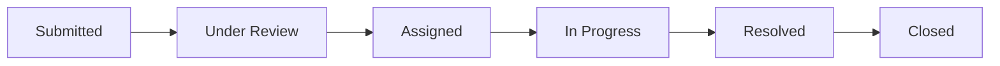

# College Complaint Management System

> A centralized digital platform for students to report campus issues and track them through to resolution.


---

## Overview

The College Complaint Management System is a web-based application designed to replace the manual, ad-hoc complaint process with a structured digital workflow. Students can submit complaints related to classrooms, laboratories, hostels, Wi-Fi, infrastructure, transportation, cleanliness, or any other campus facility — complete with category, location, and optional file attachments.

The system connects students with the appropriate college department or administrator, providing full visibility into complaint status. Every complaint follows a defined lifecycle from submission through resolution, with timestamps and actor logging at each transition for full auditability.

Students can track their complaint history and view admin updates, while administrators have a unified dashboard to triage, assign, prioritize, and resolve issues across the entire college.

> See `spec.md` for the complete technical specification.

---

## Features

### Core Features

- User authentication with JWT-based sessions and role separation (student/admin)
- Student dashboard with complaint summary by status
- Complaint submission with category, description, location, priority, and file attachments
- Complaint categories: Classroom, Lab, Hostel, Wi-Fi/Network, Infrastructure, Transportation, Cleanliness, Other
- Complaint status tracking through a defined lifecycle pipeline
- Complaint history and details page with attachments, status timeline, and admin comments
- Admin dashboard with complaint counts by status, category, and priority
- Admin complaint management with search and multi-criteria filtering
- Department/staff assignment and priority setting (Low / Medium / High / Critical)
- Status management to move complaints through the pipeline
- Admin comments and resolution notes
- Basic complaint statistics (totals, resolved vs. open)
- Responsive UI for desktop and mobile browsers
- Image/file attachment upload and retrieval

### Bonus / Planned Features

- Email notifications on status change (Nodemailer)
- Real-time status notifications (Socket.IO)
- Admin analytics dashboard with charts by category/department/time
- Department-wise statistics and resolution time tracking
- Student feedback and resolution rating after closure
- Duplicate complaint detection
- AI-based complaint categorization from free-text description
- AI-generated complaint summaries for admins
- Image-based issue classification
- Automatic escalation for complaints unresolved past an SLA window
- Mobile-responsive / installable PWA interface

---

## Complaint Lifecycle



| Stage | Description |
|---|---|
| **Submitted** | Student creates the complaint |
| **Under Review** | Admin has seen it but not yet assigned |
| **Assigned** | Admin assigns it to a department or staff member |
| **In Progress** | Assigned staff/department is actively working on it |
| **Resolved** | Issue fixed; resolution details recorded |
| **Closed** | Student or admin confirms closure, optionally with feedback |

---

## Tech Stack

| Layer | Technology |
|---|---|
| Frontend | React (Vite) or Next.js, Tailwind CSS, Zustand/Context API, Axios, react-hot-toast, lucide-react |
| Backend | Node.js, Express, Mongoose, JSON Web Tokens, bcryptjs, multer, express-validator, helmet, morgan, cors |
| Database | MongoDB (MongoDB Atlas) |
| Storage | Local disk or Cloudinary/S3-compatible bucket |
| Notifications | Nodemailer (email), Socket.IO (real-time) |
| Deployment | Vercel/Netlify (frontend), Render/Railway (backend), MongoDB Atlas (database) |

---

## Project Structure

### Frontend

```
client/
└── src/
    ├── components/
    │   ├── AppShell/
    │   ├── ComplaintCard/
    │   ├── ComplaintForm/
    │   ├── StatusBadge/
    │   ├── StatsWidgets/
    │   └── ProtectedRoute/
    ├── pages/
    │   ├── index.jsx
    │   ├── login.jsx
    │   ├── register.jsx
    │   ├── student/
    │   │   ├── dashboard.jsx
    │   │   ├── new-complaint.jsx
    │   │   ├── my-complaints.jsx
    │   │   └── complaint/[id].jsx
    │   └── admin/
    │       ├── dashboard.jsx
    │       ├── complaints.jsx
    │       └── complaint/[id].jsx
    ├── store/
    │   └── authStore.js
    └── services/
        └── api.js
```

### Backend

```
server/
└── src/
    ├── config/
    │   ├── env.js
    │   └── db.js
    ├── routes/
    │   ├── authRoutes.js
    │   ├── complaintRoutes.js
    │   ├── departmentRoutes.js
    │   └── statsRoutes.js
    ├── controllers/
    │   ├── authController.js
    │   ├── complaintController.js
    │   └── statsController.js
    ├── services/
    │   ├── authService.js
    │   ├── complaintService.js
    │   └── uploadService.js
    ├── models/
    │   ├── User.js
    │   ├── Complaint.js
    │   ├── ComplaintUpdate.js
    │   ├── Department.js
    │   └── Notification.js
    └── middleware/
        ├── authMiddleware.js
        └── errorHandler.js
```

---

## Getting Started

### Prerequisites

- **Node.js** v18 or higher
- **MongoDB** (local instance or MongoDB Atlas account)
- **npm** or **yarn**

### Clone the Repository

```bash
git clone <repository-url>
cd Complaint-Management-System
```

### Environment Variables

Create a `.env` file in the `server/` directory with the following variables:

```env
# Server
PORT=5000
NODE_ENV=development

# MongoDB
MONGODB_URI=mongodb://localhost:27017/complaint-management
# Or for Atlas: mongodb+srv://<username>:<password>@cluster.mongodb.net/complaint-management

# Authentication
JWT_SECRET=your_jwt_secret_here
JWT_EXPIRES_IN=7d

# Client
CLIENT_URL=http://localhost:5173

# File Uploads (placeholder — choose one)
UPLOAD_DIR=./uploads
# CLOUDINARY_CLOUD_NAME=your_cloud_name
# CLOUDINARY_API_KEY=your_api_key
# CLOUDINARY_API_SECRET=your_api_secret
```

> **Note:** All secret values above are placeholders. Replace them with your own secure values before running in production.

### Install and Run

**Backend:**

```bash
cd server
npm install
npm run dev
```

**Frontend:**

```bash
cd client
npm install
npm run dev
```

The frontend will be available at `http://localhost:5173` and the backend API at `http://localhost:5000`.

---

## API Reference

### Auth

| Method | Endpoint | Description | Auth |
|---|---|---|---|
| POST | `/api/auth/register` | Register a new student or admin account | Public |
| POST | `/api/auth/login` | Authenticate user and issue JWT | Public |
| GET | `/api/auth/me` | Fetch current user profile | Student / Admin |

### Complaints (Student)

| Method | Endpoint | Description | Auth |
|---|---|---|---|
| POST | `/api/complaints` | Submit a new complaint with optional attachments | Student |
| GET | `/api/complaints/mine` | List complaints submitted by the logged-in student | Student |
| GET | `/api/complaints/:id` | Fetch a single complaint's details and status timeline | Student |
| POST | `/api/complaints/:id/feedback` | Submit feedback/rating after resolution (bonus) | Student |

### Complaints (Admin)

| Method | Endpoint | Description | Auth |
|---|---|---|---|
| GET | `/api/complaints` | List all complaints with pagination/filter/search | Admin |
| PATCH | `/api/complaints/:id/assign` | Assign a complaint to a department/staff member | Admin |
| PATCH | `/api/complaints/:id/status` | Update complaint status with optional comment | Admin |
| PATCH | `/api/complaints/:id/priority` | Update complaint priority | Admin |
| POST | `/api/complaints/:id/resolve` | Mark resolved and record resolution details | Admin |

### Departments

| Method | Endpoint | Description | Auth |
|---|---|---|---|
| GET | `/api/departments` | List departments | Admin |
| POST | `/api/departments` | Create a department | Admin |

### Statistics & Notifications

| Method | Endpoint | Description | Auth |
|---|---|---|---|
| GET | `/api/stats/dashboard` | Aggregated counts by status/category/priority | Admin |
| GET | `/api/notifications` | List notifications for the logged-in user | Student / Admin |

---

## Database Models

### Users

`name`, `email`, `password` (select: false), `role` (student | admin), `department` (for admin), `createdAt`

### Complaints

`title`, `description`, `category`, `location`, `priority` (low | medium | high | critical), `status`, `attachments` [{url, filename, mimeType}], `submittedBy` (ref User), `assignedDepartment`, `assignedTo` (ref User), `resolutionDetails`, `createdAt`, `updatedAt`

### ComplaintUpdates

`complaintId` (ref Complaint), `actor` (ref User), `actorRole`, `previousStatus`, `newStatus`, `comment`, `createdAt`

### Departments

`name`, `description`, `staffMembers` [ref User]

### Notifications

`owner` (ref User), `complaintId`, `type`, `title`, `message`, `isRead`, `createdAt`

---

## Development Phases / Roadmap

- [x] **Phase 1** — Project setup: frontend/backend scaffolding, MongoDB connection, JWT authentication, role-based route protection
- [x] **Phase 2** — Complaint submission & student experience: complaint form, student dashboard, complaint history, complaint details page
- [x] **Phase 3** — Admin experience: admin dashboard, complaint list with search/filter, department/staff assignment, priority & status management, resolution notes
- [x] **Phase 4** — Statistics & polish: basic dashboard statistics, responsive UI pass, loading/empty states, deployment
- [ ] **Phase 5** — Bonus: notifications, resolution feedback/rating, analytics dashboard, escalation rules, AI-assisted categorization/summaries

---

## Security Notes

- Passwords are hashed with **bcrypt** (cost factor 12)
- JWTs are signed and verified using a secret from environment configuration
- All request bodies are validated with **express-validator**
- Admin-only routes are restricted via **role-based middleware**
- File uploads are sanitized and size-limited
- CORS is restricted to the deployed client URL
- **Helmet** is used for HTTP security headers
- Students cannot view other students' complaints — only admins have cross-user access

---

## Contributing

1. Fork the repository
2. Create a feature branch (`git checkout -b feature/your-feature`)
3. Commit your changes (`git commit -m "Add your feature"`)
4. Push to the branch (`git push origin feature/your-feature`)
5. Open a Pull Request

---

## License

This project is licensed under the MIT License. See `spec.md` for the complete technical specification.
# College-Complaint-Management-System

